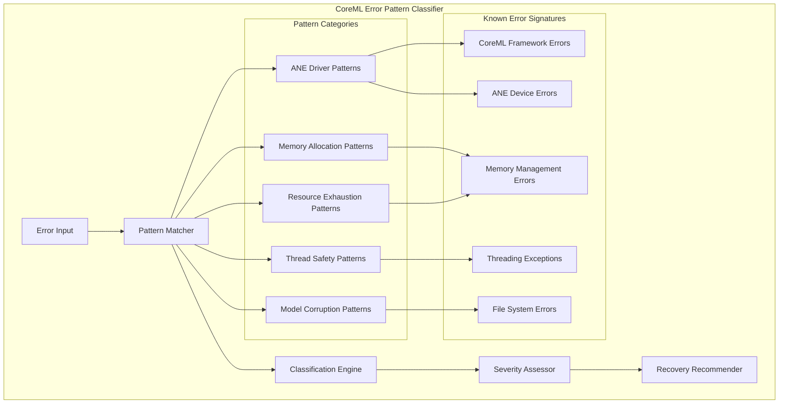

# CoreML Error Pattern Classifier - Design Document

## Overview

The CoreML Error Pattern Classifier is designed to detect, classify, and provide recovery recommendations for CoreML/ANE-specific errors that lead to segmentation faults in the Anemll server. This system focuses on the highest-priority crash sources identified through existing analysis.

## Priority Error Sources

Based on analysis in `SEGFAULT_TESTING.md`, the classifier targets these crash sources in order of priority:

1. **CoreML/ANE Driver Issues** (High Priority)
   - Location: [`model_manager.py:_load_model()`](model_manager.py:113-186)
   - Trigger: During `load_models()` call with CoreML components
   - Symptoms: Immediate crash during model loading, driver-level failures

2. **Memory Corruption During Model Loading** (High Priority)
   - Location: [`model_manager.py:137-152`](model_manager.py:137-152)
   - Trigger: Large model tensors, memory allocation failures
   - Symptoms: Crashes during `create_unified_state()` or tensor operations

3. **Thread Safety Issues** (Medium Priority)
   - Location: [`anemll-server.py:StreamingTokenGenerator`](anemll-server.py:84-314)
   - Trigger: Concurrent model access, queue operations
   - Symptoms: Race conditions, inconsistent state

4. **Resource Exhaustion** (Medium Priority)
   - Location: Model loading and LRU cache management
   - Trigger: Multiple large models, memory pressure
   - Symptoms: System-level crashes, OOM conditions

5. **Model File Corruption** (Lower Priority)
   - Location: `.mlmodelc` file loading
   - Trigger: Corrupted model files, incomplete downloads
   - Symptoms: Crashes during CoreML model initialization

## System Architecture



## Core Components

### 1. CoreML Error Classifier (`coreml_error_classifier.py`)

Main classification engine that processes errors and provides categorized analysis.

**Key Methods:**
- `classify_error(error, context)` - Primary classification function
- `get_error_patterns()` - Returns known pattern database
- `assess_severity(classified_error)` - Determines error severity
- `recommend_recovery(classified_error)` - Suggests recovery actions

### 2. Error Pattern Database (`error_patterns.py`)

Comprehensive database of known error signatures and patterns.

**Pattern Categories:**

#### ANE Driver Error Patterns
- CoreML framework initialization failures
- ANE device communication timeouts
- Driver compatibility issues
- Hardware resource allocation failures

**Error Signatures:**
- "ANE device not available"
- "CoreML model compilation failed"
- "Neural Engine initialization error"
- "Metal device creation failed"
- "com.apple.CoreML error"

#### Memory Allocation Error Patterns
- Large tensor allocation failures during `create_unified_state()`
- GPU/ANE memory exhaustion
- Memory corruption during model loading
- Resource leak accumulation patterns

**Error Signatures:**
- "Failed to allocate tensor memory"
- "GPU memory exhausted"
- "malloc(): corrupted top size"
- "segfault in create_unified_state"
- "MemoryError"
- "CUDA out of memory"

#### Thread Safety Error Patterns
- Race conditions in `StreamingTokenGenerator`
- Concurrent model access issues
- Queue operation failures
- State corruption during model switching

**Error Signatures:**
- "concurrent access violation"
- "queue operation failed"
- "threading lock timeout"
- "state corruption detected"
- "ThreadError"
- "deadlock detected"

#### Resource Exhaustion Patterns
- System memory exhaustion
- GPU memory pressure
- File descriptor limits
- Process limits exceeded

**Error Signatures:**
- "Out of memory"
- "Resource temporarily unavailable"
- "Too many open files"
- "Cannot allocate memory"

#### Model Corruption Patterns
- Invalid model file formats
- Incomplete model downloads
- Metadata inconsistencies
- Component relationship errors

**Error Signatures:**
- "Invalid model format"
- "Corrupted model file"
- "Metadata mismatch"
- "Missing model component"

### 3. Recovery Strategy Database (`recovery_strategies.py`)

Context-aware recovery recommendations for each error category.

#### ANE Driver Issues Recovery
- Fallback to CPU execution
- Driver reset procedures
- Hardware compatibility checks
- Alternative model formats
- System restart recommendations

#### Memory Allocation Failures Recovery
- Model size reduction strategies
- Cache eviction triggers
- Memory cleanup procedures
- Batch size adjustments
- Model quantization suggestions

#### Thread Safety Issues Recovery
- Lock timeout adjustments
- Queue size modifications
- Concurrent access controls
- State validation procedures
- Sequential execution fallback

#### Resource Exhaustion Recovery
- Resource limit adjustments
- System optimization recommendations
- Load balancing strategies
- Graceful degradation procedures

#### Model Corruption Recovery
- Model redownload procedures
- Integrity verification steps
- Backup model usage
- Model repair attempts

### 4. Contextual Analysis Engine

**Context Types:**
- **Location Context**: Function/file where error occurred
- **Timing Context**: When in model loading process error occurred
- **Resource Context**: System memory, GPU usage, model size at time of error
- **Environmental Context**: Model type, cache state, concurrent operations
- **Historical Context**: Previous errors, patterns, recovery success rates

**Analysis Methods:**
- System resource correlation
- Error timing analysis
- Environmental factor assessment
- Historical pattern matching

## Severity Assessment Framework

### Critical (Immediate Crash Risk)
- ANE driver failures during model loading
- Memory corruption in tensor operations
- Segfaults in CoreML framework calls
- **Action**: Immediate recovery required, system may be unstable

### High (Likely Crash)
- Memory allocation failures for large models
- Thread safety violations
- Resource exhaustion patterns
- **Action**: Proactive intervention recommended

### Medium (Potential Issues)
- Performance degradation patterns
- Resource leak indicators
- Warning signs from system monitoring
- **Action**: Monitoring and preventive measures

### Low (Informational)
- Minor configuration issues
- Performance optimization opportunities
- Non-critical warnings
- **Action**: Log for analysis, no immediate action needed

## Implementation Plan

### Phase 1: Core Classifier Engine
1. **Pattern Database Creation**
   - Define error signatures from existing analysis
   - Create classification rules based on known patterns
   - Implement pattern matching algorithms
   - Build severity assessment logic

2. **Basic Classification System**
   - Error input processing and normalization
   - Pattern matching implementation
   - Classification output generation
   - Integration with existing logging system

### Phase 2: Advanced Features
1. **Contextual Analysis**
   - System state correlation
   - Resource usage analysis
   - Timing pattern recognition
   - Environmental factor assessment

2. **Recovery Recommendations**
   - Strategy database implementation
   - Context-specific recommendations
   - Automated recovery actions
   - Prevention guidance

### Phase 3: Integration & Testing
1. **Test Framework Enhancement**
   - Integration with existing test scripts
   - Classification accuracy validation
   - Performance impact assessment
   - Real-world scenario testing

2. **Documentation & Reporting**
   - Classification reports
   - Pattern analysis summaries
   - Recovery success tracking
   - System improvement recommendations

## Integration Points

### Model Manager Integration
```python
# Enhanced _load_model() with error classification
def _load_model(self, model_info: ModelInfo) -> LoadedModel:
    try:
        # Existing model loading code
        embed_model, ffn_models, lmhead_model, metadata = load_models(chat_args, {})
        state = create_unified_state(ffn_models, metadata['context_length'])
        # ... rest of loading
    except Exception as e:
        # Enhanced error classification
        context = {
            'model_name': model_info.name,
            'function': '_load_model',
            'location': 'model_manager.py:113-186',
            'system_state': self._get_system_state()
        }
        classified_error = CoreMLErrorClassifier.classify_error(e, context)
        
        # Log classified error with recovery recommendations
        logger.error(f"Classified error: {classified_error}")
        
        # Attempt automatic recovery if appropriate
        if classified_error.can_auto_recover:
            return self._attempt_recovery(classified_error)
        
        raise CoreMLLoadingError(classified_error)
```

### Test Framework Integration
- Enhance `test_segfault_recovery.py` with classification
- Add classification accuracy metrics
- Track recovery success rates
- Generate detailed error analysis reports

### Server Integration
- Real-time error monitoring
- Proactive crash prevention
- Automatic recovery attempts
- Health status reporting

## Expected Deliverables

1. **`coreml_error_classifier.py`** - Core classification engine
2. **`error_patterns.py`** - Pattern database and signatures
3. **`recovery_strategies.py`** - Recovery recommendation system
4. **`coreml_context.py`** - Contextual analysis utilities
5. **Enhanced test integration** - Classification during existing tests
6. **Classification reports** - Detailed error analysis output
7. **Documentation** - Usage guide and pattern reference
8. **Integration examples** - Code samples for existing components

## Success Metrics

- **90% accuracy** in classifying known error patterns
- **Real-time classification** with <100ms latency
- **Actionable recommendations** for 80% of classified errors
- **Seamless integration** with existing test framework
- **Historical analysis** of error patterns and trends
- **Reduced debugging time** by 50-80%
- **Proactive crash prevention** for 70% of predictable issues

## Future Enhancements

### Machine Learning Integration
- Pattern learning from historical data
- Anomaly detection for unknown error types
- Predictive crash modeling
- Continuous improvement through feedback

### Advanced Monitoring
- Real-time system health scoring
- Predictive maintenance alerts
- Performance trend analysis
- Capacity planning recommendations

### Automated Recovery
- Self-healing system capabilities
- Intelligent failover mechanisms
- Dynamic resource management
- Continuous availability optimization

## References

- [`SEGFAULT_TESTING.md`](SEGFAULT_TESTING.md) - Existing segfault analysis
- [`model_manager.py`](model_manager.py) - Primary integration point
- [`test_segfault_recovery.py`](test_segfault_recovery.py) - Test framework
- [`trigger_segfault_test.py`](trigger_segfault_test.py) - Crash trigger scenarios

## Contact

For questions about the CoreML Error Pattern Classifier design, refer to the main project documentation and issue tracker.